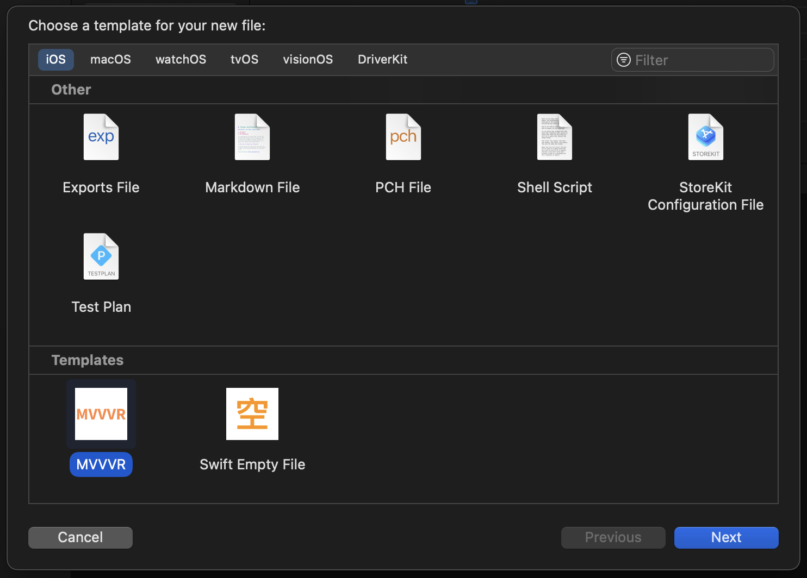

Title: MVVR Template  
Category: [Project][L1]  
Labels: [Xcode][L2], [MyProject][L3]  
Discussion: [Link][L4]

## 前言  
基於 [MVVVR][L5] 架構創建的 Xcode Templabe

## 使用方法

下載 [最新版本][L6] Template.zip, 解壓縮後將 `MVVVR.xctemplate` 移動到目錄之下, 如果目錄不存在, 請自行創建.

```
~/Library/Developer/Xcode/Templates
```

開啟 Xcode -> New File, 滑動到最下方, 就會找到 Template, 然後創建 MVVVR  模組.



[L1]: https://github.com/shinrenpan/Note/discussions/categories/project
[L2]: https://github.com/shinrenpan/Note/discussions?discussions_q=label:xcode
[L3]: https://github.com/shinrenpan/Note/discussions?discussions_q=label:MyProject
[L4]: [https://github.com/](https://github.com/shinrenpan/Note/discussions/28)
[L5]: https://github.com/shinrenpan/Note/discussions/27
[L6]: https://github.com/shinrenpan/MVVVR-Template/releases/latest/
